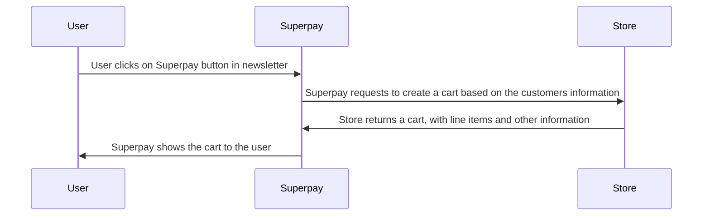

# OpenAPI Specification
This is a list of endpoints that should be supported by the store.
It's totally optional what each endpoint path should be, but the request and response should be the same.

## Simplified flow
Here is a very simplified flow, to give an idea of how the integration works.

<swagger-ui src="https://5flxygi5pd.execute-api.eu-central-1.amazonaws.com/prod/api/stores/webhooks-openapi-doc"/>